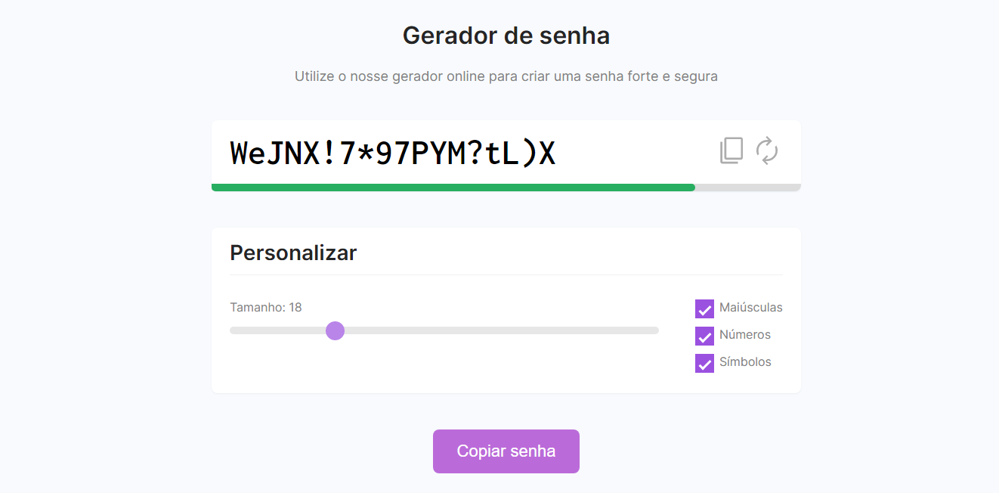

<h1 align="center"> Generate Password </h1>

Projeto desenvolvido durante uma aula do curso Dominando o React da DevSamurai

  <a href="#-tecnologias">Tecnologias</a>&nbsp;&nbsp;&nbsp;|&nbsp;&nbsp;&nbsp;
  <a href="#-projeto">Projeto</a>&nbsp;&nbsp;&nbsp;

 

  

## 🚀 Tecnologias

Esse projeto foi desenvolvido com as seguintes tecnologias:

- HTML
- CSS
- JavaScript

## 💻 Projeto

O generate password é um projeto onde é gerado uma senha aleatória a cada refresh, é possível escolher se a senha irá conter números, símbolos, e caracteres maiúsculos
